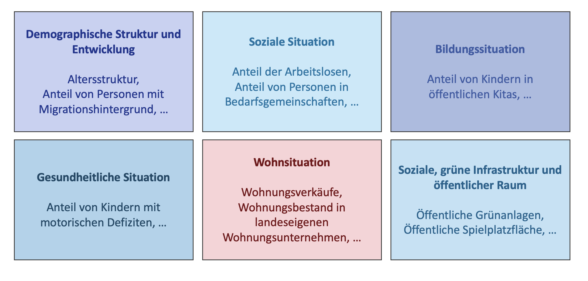

import styles from '../docs.module.css';
import Tabs from '@theme/Tabs';
import TabItem from '@theme/TabItem';
import { CircleStackIcon, BuildingOffice2Icon, UsersIcon } from '@heroicons/react/24/solid';

  

    

      <h1>Digitale Bezirksregionenprofile</h1>
        

          Wie entwickeln sich demographische und soziale Strukturen in Bezirksregionen? Mit Datenbanken und Dashboard-Templates wird der Prozess zur Erstellung der Bezirksregionenprofile als zentrale Instrumente der Stadtentwicklung effizienter und einheitlicher.
        

    

  

## Was sind die Berliner Bezirksregionenprofile?

Die Berliner Bezirksregionenprofile (BZRP) geben regelmäßig Auskunft über die sozio-ökonomische Lage der Bezirksregionen. Jedes Profil besteht aus zwei Teilen: einer Analyse zentraler demografischer und sozialer Indikatoren (Kurzprofil) sowie einer Beschreibung der auf dieser Analyse basierenden Maßnahmen und Ziele für den jeweiligen Bezirk.
Die Erstellung der Profile erfolgt derzeit innerhalb der Bezirke durch spezialisierte Personen oder Teams aus dem Bereichen der sozialraumorientierten Planungskoordination. Als Datengrundlage dienen Informationen des Amtes für Statistik Berlin-Brandenburg sowie der Senatsverwaltung für Stadtentwicklung, Bauen und Wohnen, ergänzt um bezirksspezifische Daten.

## Das Problem

Der derzeitige Prozess rund um die Erstellung und Veröffentlichung der Bezirksregionenprofile ist für viele Beteiligte nicht mehr zufriedenstellen. Grund dafür sind:

- **Hoher manueller Aufwand:** Die Erstellung der BZRP ist sehr zeitaufwendig, da viele Prozesse manuell erfolgen, inklusive Datenexporten, analoger Arbeitsschritte und Medienbrüchen. Aufgrund mangelnder Ressourcen und weil die BZRP regelmäßig neu erstellt werden müssen, bleibt in vielen Bezirken so keine Zeit für die eigentliche tiefergehende Analyse der Daten und die Erstellung von Maßnahmenbeschreibungen über die Kurzprofile hinaus
- **Uneinheitliche Veröffentlichungen:** Die Daten werden über das PRISMA-Fachverfahren bereitgestellt, das Verschneidung, Aggregation und Visualisierung der Daten ermöglicht, aber keine standardisierte Veröffentlichung nach außen vorsieht. Dies führt zu starken Unterschieden zwischen den Bezirken: Einige nutzen aufwendig erstellte interaktive Diagramme und Karten aus dem Tool Datawrapper, während die meisten Profile nach wie vor nur als PDF verfügbar sind.

## Zielsetzung

Der Data Hub wird eingesetzt, um den Prozess zur Erstellung der BZRP zu vereinfachen und gleichzeitig ein modernes, einheitliches Produkt entstehen zu lassen:

- **Interaktive Dashboards** ergänzen die bisherige PDF-Darstellung und machen die Daten deutlich nutzerfreundlicher. Für jeden Bezirk wird ein Dashboard als zentrales Informationsangebot bereitgestellt, das mit aktuellen Daten gefüllt wird. Nutzer:innen können gezielt nach Bezirksregionen und Jahren filtern, während Fachabteilungen sowie externe Interessierte wie Journalist:innen, Initiativen oder Stadtplaner:innen unkompliziert auf die Daten zugreifen können.
- **Die bisherigen jährlichen manuellen Update-Prozesse entfallen**, da die Daten automatisch über moderne ETL-Prozesse in die Dashboards eingespeist werden. Dadurch wird die Arbeit der Verwaltung erheblich erleichtert, und die Zeitersparnis bei der Analyse der Kernindikatoren ermöglicht es, sich stärker auf den zweiten Teil der BZRP zu konzentrieren — die Beschreibung von Zielen und Maßnahmen.
- **Durch standardisierte Datenformate** ist zudem ein besserer Vergleich der Kernindikatoren zwischen den Bezirken möglich. Die Ersteller:innen können auf abgestimmte Templates zurückgreifen, gleichzeitig aber auch bezirksspezifische Daten in eigenen Charts darstellen und ihre Dashboards modular erweitern. So entsteht ein flexibles, konsistentes und gleichzeitig anpassbares System.

## Die Umsetzung 

### Der Rahmen des Pilotprojekts

<Tabs
  defaultValue="daten"
  values={[
    { label: 'Daten', value: 'daten' },
    { label: 'Zielgruppen', value: 'zielgruppen' },
    { label: 'Beteiligte', value: 'beteiligte' },
  ]}>

  <TabItem value="daten">
  <>
    

      

        <CircleStackIcon className="w-5 h-5 text-green-600" />
        <h3 className="inline pl-2">Die Daten</h3>
      

      

        Die <strong>Hauptdatengrundlage</strong> stammt vom Amt für Statistik Berlin Brandenburg. Durch regelmäßigen Austausch entsteht ein <strong>abgestimmter Datenpool</strong> zwischen den 12 Bezirken und der Senatsverwaltung für Stadtentwicklung, Bauen und Wohnen. 
        Er umfasst demografische Daten wie Einwohnerzahl nach Alter, Geschlecht oder Migrationsstatus sowie Indikatoren zu Gesundheit, sozialer Lage, Bildung und Wohnsituation.
      
  
      
    

  </>
  </TabItem>

  <TabItem value="zielgruppen">
  <>
    

      

        <UsersIcon className="w-5 h-5 text-green-600" />
        <h3 className="inline pl-2">Die Zielgruppen</h3>
      

      

        Die BZRP richten sich an:
      

      <ul className="ml-4 list-disc">
        <li>Fachpersonen aus der Verwaltung, zum Beispiel</li>
          <ul className="ml-4 list-disc">
            <li>Datenkoordinator:innen</li>
            <li>Fachämter der Bezirke</li>
            <li>Fachamt für Stadtplanung</li>
          </ul>   
        <li>Externe Interessierte, zum Beispiel</li>
          <ul className="ml-4 list-disc">
            <li>Zivilgesellschaft</li>
            <li>Personen aus Wissenschaft und Journalismus</li>
            <li>Stadtplaner:innen</li>
            <li>Privatwirtschaft</li>
          </ul>
        
      </ul>
    

  </>
  </TabItem>

  <TabItem value="beteiligte">
  <>
    

      

        <BuildingOffice2Icon className="w-5 h-5 text-green-600" />
        <h3 className="inline pl-2">Die Beteiligten</h3>
      

      

        Beim Pilotprojekt zu den digitalen Bezirksregionenprofilen sind eine Vielzahl an Personen und Stellen eingebunden:
      

      <ul className="ml-4 list-disc">
        <li>Senatsverwaltung für Stadtentwicklung, Bauen und Wohnen, Referat I A 38</li>
        <li>Organisationseinheit "Sozialraumorientierte Planungskoordination" (OESPK), inklusive der bezirklichen Datenkoordinator:innen</li>
        <li>Ein Dienstleister zur Unterstützung bei der Gestaltung der BZRPs</li>
        <li>Regional- und Stadtteilkoordinator:innen</li>
      </ul>
    

  </>
  </TabItem>

</Tabs>

### Technische Lösung im Data Hub
- Datenfluss: Tabellarische Daten werden vom Amt für Statistik an die Senatsverwaltung für Stadtentwicklung, Bauen und Wohnen übermittelt und in das Fachverfahren PRISMA geladen.  
- Parallel werden die Daten in die relationale Datenbank des Data Hub importiert, inklusive bezirksspezifischer Daten, die unterschiedlich formatiert vorliegen.  
- Für interaktive Dashboards wird Superset genutzt, mit Rechtemanagement, sodass jede:r Datenkoordinator:in nur das eigene Dashboard bearbeiten kann.

<iframe
  src="https://data-hub-flow-designer.lovable.app/?flow=JTdCJTIybm9kZXMlMjIlM0ElNUIlN0IlMjJpZCUyMiUzQSUyMmJlemlya3NhbXQlMjIlMkMlMjJ0eXBlJTIyJTNBJTIyc291cmNlJTIyJTJDJTIycG9zaXRpb24lMjIlM0ElN0IlMjJ4JTIyJTNBNTAlMkMlMjJ5JTIyJTNBNTAlN0QlMkMlMjJkYXRhJTIyJTNBJTdCJTIybGFiZWwlMjIlM0ElMjJCZXppcmtzYW10JTIyJTJDJTIyc3VidGl0bGUlMjIlM0ElMjJDU1YtRGF0ZWklMjIlN0QlMkMlMjJtZWFzdXJlZCUyMiUzQSU3QiUyMndpZHRoJTIyJTNBMTgwJTJDJTIyaGVpZ2h0JTIyJTNBNzIlN0QlN0QlMkMlN0IlMjJpZCUyMiUzQSUyMm9wZW5kYXRhLWNzdiUyMiUyQyUyMnR5cGUlMjIlM0ElMjJzb3VyY2UlMjIlMkMlMjJwb3NpdGlvbiUyMiUzQSU3QiUyMnglMjIlM0EyODAlMkMlMjJ5JTIyJTNBNTAlN0QlMkMlMjJkYXRhJTIyJTNBJTdCJTIybGFiZWwlMjIlM0ElMjJPcGVuJTIwRGF0YSUyMiUyQyUyMnN1YnRpdGxlJTIyJTNBJTIyQ1NWLURhdGVpJTIyJTdEJTJDJTIybWVhc3VyZWQlMjIlM0ElN0IlMjJ3aWR0aCUyMiUzQTE4MCUyQyUyMmhlaWdodCUyMiUzQTcyJTdEJTdEJTJDJTdCJTIyaWQlMjIlM0ElMjJvcGVuZGF0YS13ZnMlMjIlMkMlMjJ0eXBlJTIyJTNBJTIyc291cmNlJTIyJTJDJTIycG9zaXRpb24lMjIlM0ElN0IlMjJ4JTIyJTNBNzUwJTJDJTIyeSUyMiUzQTUwJTdEJTJDJTIyZGF0YSUyMiUzQSU3QiUyMmxhYmVsJTIyJTNBJTIyT3BlbiUyMERhdGElMjIlMkMlMjJzdWJ0aXRsZSUyMiUzQSUyMldGUyUyMiU3RCUyQyUyMm1lYXN1cmVkJTIyJTNBJTdCJTIyd2lkdGglMjIlM0ExODAlMkMlMjJoZWlnaHQlMjIlM0E3MiU3RCU3RCUyQyU3QiUyMmlkJTIyJTNBJTIycHJvY2Vzc2luZyUyMiUyQyUyMnR5cGUlMjIlM0ElMjJwcm9jZXNzaW5nJTIyJTJDJTIycG9zaXRpb24lMjIlM0ElN0IlMjJ4JTIyJTNBODAlMkMlMjJ5JTIyJTNBMjUwJTdEJTJDJTIyZGF0YSUyMiUzQSU3QiUyMmxhYmVsJTIyJTNBJTIyTm90ZSUyMFJlZCUyMiUyQyUyMnRpdGxlJTIyJTNBJTIyRGF0ZW52ZXJhcmJlaXR1bmclMjIlMkMlMjJkZXNjcmlwdGlvbiUyMiUzQSUyMlB5dGhvbiUyMHVuZCUyMFNRTC1TY3JpcHRlJTIwd2VyZGVuJTIwdmVyYXJiZWl0ZXQlMjB1bmQlMjB3ZWl0ZXJnZWxlaXRldC4lMjIlN0QlMkMlMjJtZWFzdXJlZCUyMiUzQSU3QiUyMndpZHRoJTIyJTNBMzgwJTJDJTIyaGVpZ2h0JTIyJTNBMTA4JTdEJTdEJTJDJTdCJTIyaWQlMjIlM0ElMjJkYXRhYmFzZSUyMiUyQyUyMnR5cGUlMjIlM0ElMjJjb21wb25lbnQlMjIlMkMlMjJwb3NpdGlvbiUyMiUzQSU3QiUyMnglMjIlM0E1MCUyQyUyMnklMjIlM0E0NTAlN0QlMkMlMjJkYXRhJTIyJTNBJTdCJTIybGFiZWwlMjIlM0ElMjJLb21wb25lbnRlJTIyJTJDJTIydGl0bGUlMjIlM0ElMjJEYXRlbmJhbmslMjIlMkMlMjJkZXNjcmlwdGlvbiUyMiUzQSUyMkRhdGVuJTIwd2VyZGVuJTIwaW4lMjBlaW5lciUyMERhdGVuYmFuayUyMGFiZ2VsZWd0JTIwdW5kJTIwZ2VzcGVpY2hlcnQuJTIyJTdEJTJDJTIybWVhc3VyZWQlMjIlM0ElN0IlMjJ3aWR0aCUyMiUzQTI4MCUyQyUyMmhlaWdodCUyMiUzQTEwOCU3RCU3RCUyQyU3QiUyMmlkJTIyJTNBJTIyZ2Vvc2VydmVyJTIyJTJDJTIydHlwZSUyMiUzQSUyMmNvbXBvbmVudCUyMiUyQyUyMnBvc2l0aW9uJTIyJTNBJTdCJTIyeCUyMiUzQTUyMCUyQyUyMnklMjIlM0E0NTAlN0QlMkMlMjJkYXRhJTIyJTNBJTdCJTIybGFiZWwlMjIlM0ElMjJLb21wb25lbnRlJTIyJTJDJTIydGl0bGUlMjIlM0ElMjJHZW9zZXJ2ZXIlMjIlMkMlMjJkZXNjcmlwdGlvbiUyMiUzQSUyMkRhdGVuJTIwd2VyZGVuJTIwZ2VvY29kaWVydCUyMHVuZCUyMGFiZ2VzcGVpY2hlcnQuJTIyJTdEJTJDJTIybWVhc3VyZWQlMjIlM0ElN0IlMjJ3aWR0aCUyMiUzQTI4MCUyQyUyMmhlaWdodCUyMiUzQTEwOCU3RCU3RCUyQyU3QiUyMmlkJTIyJTNBJTIyZGFzaGJvYXJkJTIyJTJDJTIydHlwZSUyMiUzQSUyMmRhc2hib2FyZCUyMiUyQyUyMnBvc2l0aW9uJTIyJTNBJTdCJTIyeCUyMiUzQTUwJTJDJTIyeSUyMiUzQTY1MCU3RCUyQyUyMmRhdGElMjIlM0ElN0IlMjJsYWJlbCUyMiUzQSUyMkdyYWZhbmElMjIlMkMlMjJ0aXRsZSUyMiUzQSUyMkRhc2hib2FyZCUyMiUyQyUyMmRlc2NyaXB0aW9uJTIyJTNBJTIyRGF0ZW4lMjB3ZXJkZW4lMjBpbiUyMGVpbmVtJTIwaW50ZXJha3RpdmVuJTIwRGFzaGJvYXJkJTIwdmlzdWFsaXNpZXJ0LiUyMiU3RCUyQyUyMm1lYXN1cmVkJTIyJTNBJTdCJTIyd2lkdGglMjIlM0EyODAlMkMlMjJoZWlnaHQlMjIlM0ExMjUlN0QlN0QlMkMlN0IlMjJpZCUyMiUzQSUyMmthcnRlbnRvb2wlMjIlMkMlMjJ0eXBlJTIyJTNBJTIyZGFzaGJvYXJkJTIyJTJDJTIycG9zaXRpb24lMjIlM0ElN0IlMjJ4JTIyJTNBNTIwJTJDJTIyeSUyMiUzQTY1MCU3RCUyQyUyMmRhdGElMjIlM0ElN0IlMjJsYWJlbCUyMiUzQSUyMk1hc3RlcnBvcnRhbCUyMiUyQyUyMnRpdGxlJTIyJTNBJTIyS2FydGVudG9vbCUyMiUyQyUyMmRlc2NyaXB0aW9uJTIyJTNBJTIyRGF0ZW4lMjB3ZXJkZW4lMjBhdWYlMjBlaW5lciUyMGludGVyYWt0aXZlbiUyQyUyMGRpZ2l0YWxlbiUyMEthcnRlJTIwZGFyZ2VzdGVsbHQuJTIyJTdEJTJDJTIybWVhc3VyZWQlMjIlM0ElN0IlMjJ3aWR0aCUyMiUzQTI4MCUyQyUyMmhlaWdodCUyMiUzQTEyNSU3RCU3RCU1RCUyQyUyMmVkZ2VzJTIyJTNBJTVCJTdCJTIyaWQlMjIlM0ElMjJlLWJlemlya3NhbXQtcHJvYyUyMiUyQyUyMnNvdXJjZSUyMiUzQSUyMmJlemlya3NhbXQlMjIlMkMlMjJ0YXJnZXQlMjIlM0ElMjJwcm9jZXNzaW5nJTIyJTJDJTIydHlwZSUyMiUzQSUyMnNtb290aHN0ZXAlMjIlMkMlMjJtYXJrZXJFbmQlMjIlM0ElN0IlMjJ0eXBlJTIyJTNBJTIyYXJyb3djbG9zZWQlMjIlN0QlN0QlMkMlN0IlMjJpZCUyMiUzQSUyMmUtY3N2LXByb2MlMjIlMkMlMjJzb3VyY2UlMjIlM0ElMjJvcGVuZGF0YS1jc3YlMjIlMkMlMjJ0YXJnZXQlMjIlM0ElMjJwcm9jZXNzaW5nJTIyJTJDJTIydHlwZSUyMiUzQSUyMnNtb290aHN0ZXAlMjIlMkMlMjJtYXJrZXJFbmQlMjI"
  width="100%"
  height="400"
  style={{ border: "1px solid #ccc", borderRadius: "8px" }}
  allowFullScreen
></iframe>

### Organisatorisch und methodische Begleitung
Zur Umsetzung wurden Methoden eingesetzt, die Prozessstruktur und Einbindung aller relevanten Akteure sichern.  

- Workshops mit einer [Entwicklungsmatrix](https://www.oeffentliches-gestalten.de/buch/vorbereiten/ist-zustand-betrachten) zur Analyse des IST-Zustands  
- [Akteurskartierung](https://www.oeffentliches-gestalten.de/buch/erkunden/system-akteure-verbinden#schl%C3%BCsselakteure-identifizieren)  
- Erstellung von Personas für Gelegenheits- und Poweruser des Dashboards, um Bedürfnisse und Kompetenzen zu verstehen  

Workshops mit einem Dashboard-Prototypen wurden genutzt, um Nutzung, technische Infrastruktur und dahinterliegende Prozesse zu testen.  

Es zeigte sich, dass ein Kompromiss nötig ist: zwischen schnellem Prototyping und der gleichzeitigen Berücksichtigung komplexer Verwaltungsprozesse. Der aktuelle Fokus liegt auf einem MVP-Dashboard, das einen Minimalkonsens aller Bezirke abbildet und die Vorteile des Use Cases kommuniziert. Perspektivisch könnte ein internes Dashboard folgen, das Prozesse und bezirksspezifische Anforderungen stärker berücksichtigt.  

## Wie geht's weiter?

### Lessons Learned
Die Erfahrungen aus der Umsetzung des BZRP-Dashboards liefern wichtige Erkenntnisse für den gesamten Data Hub-Prototypen: Sie zeigen, wie sich interaktive Datenprodukte entwickeln lassen, welche Herausforderungen beim Einbinden verschiedener Akteure auftreten und welche Ansätze für eine effizientere und skalierbare Datenbereitstellung funktionieren.

- Es ist wichtig, eine Balance zwischen schnellem Prototyping, einem tiefgründigen Verständnis der Prozesse und dem Bedürfnis, komplexe Verwaltungsabläufe zu optimieren und zu beschleunigen, zu finden. An den BZRP zeigt sich, ein bestehender Prozess und ein analoges Produkt lassen sich nicht 1 zu 1 ins Digitale überführen. Stattdessen muss im Rahmen einer möglichst sinnvollen Verwaltungsmodernisierung Stück für Stück hinterfragt und neu sortiert werden.
- Datenkommentierung und -einordnung bleiben entscheidend: Vollautomatisierte Prozesse sind derzeit (noch) nicht möglich. Sie erfordern die Erweiterung von Fachverfahren, um eine Anschlussfähigkeit über Schnittstellen und das Internet sicherzustellen.

###  Next Steps

Die Automatisierung der Datenübertragung von der Senatsverwaltung für Stadtentwicklung, Bauen und Wohnen in die Data Hub-Datenbank über Schnittstellen (z. B. Hasura/GraphQL) wird weiter vorangetrieben. Ideales Ziel wäre ein direkter Anschluss an das Fachverfahren PRISMA. Hier muss ausgelotet werden, inwiefern das möglich ist oder adäquate Push-Verfahren eingerichtet werden.

