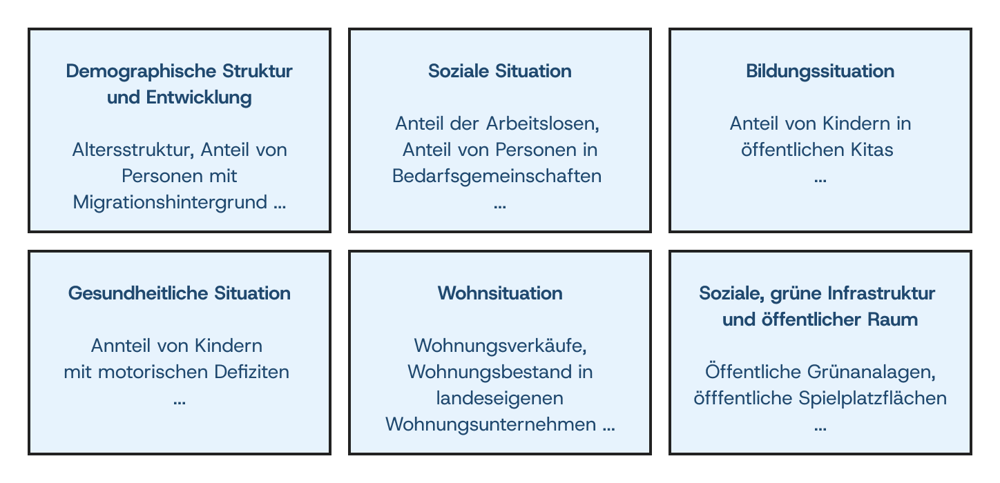

import styles from '../docs.module.css';
import Tabs from '@theme/Tabs';
import TabItem from '@theme/TabItem';
import { CircleStackIcon, BuildingOffice2Icon, UsersIcon, ArrowTopRightOnSquareIcon } from '@heroicons/react/24/solid';

  

    

      <h1>Digitale Bezirksregionenprofile als Dashboard</h1>
        

          Wie entwickeln sich demografische und soziale Strukturen in Bezirksregionen? Mit Datenbanken und Dashboard-Templates wird der Prozess zur Erstellung der Kurzfassung der Bezirksregionenprofile als Instrumente der integrierten Stadtteilentwicklung effizienter und einheitlicher.
        

    

    

      
    

  

 
## Umsetzung der Sozialraumorientierung in den Bezirken Berlins

Zur Umsetzung einer sozialräumlich orientierten Planungskoordination müssen die damit beauftragten Organisationseinheiten in der Lage sein, folgende Frage zu beantworten: Wie entwickeln sich demografische und soziale Strukturen in Berlins Bezirksregionen? Eine Lösung zur Beantwortung der Frage ist die Erstellung von Bezirksregionenprofilen.
Die Berliner Bezirksregionenprofile (BZRP) geben regelmäßig Auskunft über die soziodemographische Lage in den Bezirksregionen. Jedes Profil bezieht sich auf eine Bezirksregion und besteht in der Regel aus zwei Teilen. Teil 1 enthält die Beschreibung des IST-Zustands sowie der Entwicklung dorthin. Der auf Teil 1 basierende Teil 2 beinhaltet aus Teil 1 abgeleitete Ziele und Maßnahmen, die der Entwicklung der betrachteten Bezirksregion dienen sollen. Darüber hinaus werden in den meisten der Bezirke jährlich sogenannte Kurzprofile als kompakte Sammlung von ausgewählten Daten und Indikatoren bereitgestellt.

## Erstellung von Bezirksregionenprofilen als Instrument sozialräumlich orientierter Planung

Die Erstellung der Bezirksregionenprofile erfolgt innerhalb der Bezirke durch die Organisationseinheit Sozialraumorientierte Planungskoordination. Als Datengrundlage für Teil 1 dienen die Kernindikatoren und die Demographischen Grundzahlen für Bezirksregionenprofile und integrierte Stadt(-teil)entwicklung der Senatsverwaltung für Stadtentwicklung, Bauen und Wohnen Berlin, sowie weitere Fachdaten aus dem abgestimmten Datenpool, die vom Amt für Statistik Berlin-Brandenburg bereitgestellt werden. Ergänzt werden diese um bezirksspezifische Daten und Wissen über die Sozialräume. Die Zusammenstellung der Ziele und Maßnahmen für Teil 2 des Bezirksregionenprofils erfolgt in der Regel unter Beteiligung der verschiedenen bezirklichen Fachämter.

:::info
Ein Beispiel für Berliner Bezirkregionenprofile findet sich hier:
    

[Bezirksregionenprofile von Marzahn-Hellersdorf <ArrowTopRightOnSquareIcon className="h-5 w-5" />](https://www.berlin.de/ba-marzahn-hellersdorf/politik-und-verwaltung/service-und-organisationseinheiten/sozialraumorientierte-planungskoordination/artikel.1188693.php)

:::

## Herausforderungen

Der derzeitige Prozess der Erstellung und Veröffentlichung von Bezirksregionenprofilen, ob in kurzer oder langer Fassung, ist für viele Beteiligte nicht zufriedenstellend. Gründe dafür sind u.a.:

- **Hoher manueller Aufwand:** Die Erstellung der BZRP ist sehr zeitaufwendig, da viele Prozesse manuell erfolgen, inklusive Datenexporten, analoger Arbeitsschritte und Medienbrüchen. Darüber hinaus sind die Ressourcen knapp, komplexe Abstimmungsprozesse mit den jeweils thematisch verantwortlichen bezirklichen Fachämtern bzw. das Einholen deren fachlicher Einschätzung sind kommunikativ, organisatorisch und technisch herausfordernd und brauchen Zeit. Zudem müssen  die BZRP regelmäßig neu erstellt werden. So bleibt in vielen Bezirken wenig Zeit für die eigentliche, tiefergehende Analyse der Daten und die Ableitung von Handlungserfordernissen und Maßnahmen über die Kurzprofile von BZRP Teil 1 hinaus.
- **Uneinheitliche Veröffentlichungen:** Die Daten werden über das PRISMA-Fachverfahren bereitgestellt, das Verschneidung, Aggregation und Visualisierung der Daten ermöglicht, aber keine standardisierte Veröffentlichung nach außen vorsieht. Dies führt zu starken Unterschieden zwischen den Bezirken: Einige nutzen interaktive Diagramme aus dem Tool Datawrapper, während andere Profile nach wie vor nur als PDF verfügbar sind. Die Vielfalt an Darstellungen schränkt die Vergleichbarkeit über Bezirksgrenzen hinweg ein. Zudem ist stark von personellen Kapazitäten abhängig, ob Bezirksregionenprofile als Lang- oder Kurzversion erstellt werden.

### Einsatz von Datenbanken und Dashboard-Templates als Lösungsansatz zur effizienten Erstellung berlinweit vergleichbarer (Kurz-)Profile

## Zielsetzung

Um den oben genannten Herausforderungen wirkungsvoll zu begegnen wird der Data-Hub eingesetzt. Ziel ist es, den Prozess um die Erstellung der BZRP durch einen automatisierten Datenfluss zu vereinfachen und die Vergleichbarkeit durch einheitliches Design zu gewährleisten. Der Einsatz des Data-Hub zu diesem Zweck bietet mehrere Vorteile:
- **Interaktive Dashboards** ergänzen die bisherige PDF-Darstellung und machen die Daten deutlich nutzendenfreundlicher. Für jeden Bezirk wird ein Dashboard als zentrales Informationsangebot bereitgestellt, das mit aktuellen Daten gefüllt wird. Nutzende, die ein Überblickswissen zu einzelnen Regionen benötigen, können gezielt nach Bezirksregionen und Jahren filtern; während Fachabteilungen sowie externe Interessierte wie Medienvertreter, Initiativen oder Stadtplaner unkompliziert auf die Daten zugreifen können.
- **Die bisherigen jährlichen manuellen Update-Prozesse entfallen**, da die Daten automatisch über moderne ETL-Prozesse in die Dashboards eingespeist werden. Dadurch wird die Arbeit der Verwaltung erheblich erleichtert und die Zeitersparnis ermöglicht es, sich verstärkt der Analyse der Daten, sowie der Ableitung von Zielen und Maßnahmen zur Entwicklung von Quartieren zu widmen.
- **Durch die standardisierte Visualisierung** ist zudem ein Vergleich der Kernindikatoren und ergänzender Daten zwischen den Bezirken möglich. Die Erstellenden können in einer möglichen Ausbaustufe auf abgestimmte Templates zurückgreifen, gleichzeitig aber auch bezirksspezifische Daten in eigenen Charts darstellen und ihre Dashboards modular erweitern. So entsteht ein flexibles, konsistentes und gleichzeitig anpassbares System.

## Die Umsetzung
### Der Rahmen des Piloprojektes

<Tabs
  defaultValue="daten"
  values={[
    { label: 'Daten', value: 'daten' },
    { label: 'Zielgruppen', value: 'zielgruppen' },
    { label: 'Beteiligte', value: 'beteiligte' },
  ]}>

  <TabItem value="daten">
  <>
    

      

        <CircleStackIcon className="w-5 h-5 text-green-600" />
        <h3 className="inline pl-2">Die Daten</h3>
      

      

      Die <strong> Hauptgrundlage </strong> bilden die Daten des Amtes für Statistik Berlin-Brandenburg, die über den abgestimmten Datenpool für das Land Berlin über die gesamtstädtische Datenkoordination Sozialraumorientierung und das PRISMA-Fachverfahren der Senatsverwaltung für Stadtentwicklung, Bauen und Wohnen Berlin bereitgestellt werden. Die Daten stehen auf kleinräumlicher Ebene der Quartiere und Kieze, den sog. „Lebensweltlich orientierten Räumen“ (LOR) bereit und sind speziell für sozialräumliche Analysen im Land Berlin ausgelegt. Der abgestimmte Datenpool umfasst u.a. demographische Daten wie Einwohnerzahl nach Alter, Geschlecht oder Migrationsstatus sowie Kernindikatoren zu Themen wie Gesundheit, sozialen Lage, Bildung oder Wohnsituation.
      
  
      
    

  </>
  </TabItem>

  <TabItem value="zielgruppen">
  <>
    

      

        <UsersIcon className="w-5 h-5 text-green-600" />
        <h3 className="inline pl-2">Die Zielgruppen</h3>
      

      

        Die BZRP richten sich an:
      

      <ul className="ml-4 list-disc">
        <li>Fachpersonen aus der Verwaltung, zum Beispiel</li>
          <ul className="ml-4 list-disc">
            <li>Bürgermeisterin und Bürgermeister, Politik</li>
            <li>Senatsverwaltungen der unterschiedlichen Fachressorts</li>
            <li>Fachämter der Bezirke, insbesondere Fachämter für Stadtplanung</li>
          </ul>   
        <li>Externe Interessierte, zum Beispiel</li>
          <ul className="ml-4 list-disc">
            <li>Zivilgesellschaft</li>
            <li>Personen aus Wissenschaft und Journalismus</li>
            <li>Beauftragte Dienstleistungsbüros des Landes Berlin</li>
          </ul>
        
      </ul>
    

  </>
  </TabItem>

  <TabItem value="beteiligte">
  <>
    

      

        <BuildingOffice2Icon className="w-5 h-5 text-green-600" />
        <h3 className="inline pl-2">Die Beteiligten</h3>
      

      

        Beim Pilotprojekt zu den digitalen Bezirksregionenprofilen ist eine Vielzahl an Personen und Stellen eingebunden:
      

      <ul className="ml-4 list-disc">
        <li>Senatsverwaltung für Stadtentwicklung, Bauen und Wohnen, Referat I A - Stadtentwicklungsplanung (Projektleitung)</li>
        <li>Organisationseinheiten "Sozialraumorientierte Planungskoordination" (OE SPK) in den Berliner Bezirksämtern, hier insbesondere die bezirklichen Datenkoordinator:innen</li>
        <li>Ein Dienstleister zur Unterstützung der gesamtstädtischen Datenkoordination Sozialraumorientierung in der Senatsverwaltung für Stadtentwicklung, Bauen und Wohnen</li>
        <li>Amt für Statistik Berlin-Brandenburg, Kommunalstatistik</li>
      </ul>
    

  </>
  </TabItem>

</Tabs>

## Technische Lösung im Data Hub

Im Folgenden eine grobe Zusammenfassung, wie die technische Umsetzung im Data Hub erfolgt:

- Datenfluss: Tabellarische Daten werden vom Amt für Statistik an die Senatsverwaltung für Stadtentwicklung, Bauen und Wohnen übermittelt und dort in die PRISMA-Datenbank geladen.
- Integration in den Data Hub: Parallel dazu werden die Daten in die relationale Datenbank des Data Hub importiert. Dabei werden auch bezirksspezifische Daten berücksichtigt, die oft in unterschiedlichen Formaten vorliegen.
- Interaktive Dashboards: Für die Visualisierung und Analyse der Daten wird Superset und ein bezirksübergreifend abgestimmtes Dashboard-Template genutzt. 

<iframe
  src="https://data-hub-flow-designer.lovable.app/?flow=JTdCJTIybm9kZXMlMjIlM0ElNUIlN0IlMjJpZCUyMiUzQSUyMmJlemlya3NhbXQlMjIlMkMlMjJ0eXBlJTIyJTNBJTIyc291cmNlJTIyJTJDJTIycG9zaXRpb24lMjIlM0ElN0IlMjJ4JTIyJTNBLTEyMy4xNjc3MjI2NjQ3NTI5JTJDJTIyeSUyMiUzQTE1MS4zMzY0MTYyOTYyMzg4NCU3RCUyQyUyMmRhdGElMjIlM0ElN0IlMjJsYWJlbCUyMiUzQSUyMm1hbnVlbGxlciUyMERhdGVpdXBsb2FkJTIyJTJDJTIyc3VidGl0bGUlMjIlM0ElMjJFeGNlbC1EYXRlaSUzQSUyMEtlcm5pbmRpa2F0b3JlbiUyMChBbXQlMjBmJUMzJUJDciUyMFN0YXRpc3RpayklMjIlN0QlMkMlMjJtZWFzdXJlZCUyMiUzQSU3QiUyMndpZHRoJTIyJTNBMzM1JTJDJTIyaGVpZ2h0JTIyJTNBNzIlN0QlMkMlMjJzZWxlY3RlZCUyMiUzQWZhbHNlJTJDJTIyZHJhZ2dpbmclMjIlM0FmYWxzZSU3RCUyQyU3QiUyMmlkJTIyJTNBJTIybm9kZS0xMDAyJTIyJTJDJTIydHlwZSUyMiUzQSUyMnNvdXJjZSUyMiUyQyUyMnBvc2l0aW9uJTIyJTNBJTdCJTIyeCUyMiUzQTExOS42MjQ2NTUyMjkxNzMzOCUyQyUyMnklMjIlM0E1NS44MzE4NzAwMDA0NjMwNyU3RCUyQyUyMmRhdGElMjIlM0ElN0IlMjJsYWJlbCUyMiUzQSUyMm1hbnVlbGxlciUyMERhdGVpdXBsb2FkJTIyJTJDJTIyc3VidGl0bGUlMjIlM0ElMjJFeGNlbCUyMERhdGVpJTNBJTIwQmV2JUMzJUI2bGtlcnVuZ3NzdGF0aXN0aWtlbiUyMChBbXQlMjBmJUMzJUJDciUyMFN0YXRpc3RpayklMjIlMkMlMjJjdXN0b21MYWJlbCUyMiUzQWZhbHNlJTdEJTJDJTIybWVhc3VyZWQlMjIlM0ElN0IlMjJ3aWR0aCUyMiUzQTM3OCUyQyUyMmhlaWdodCUyMiUzQTcyJTdEJTJDJTIyc2VsZWN0ZWQlMjIlM0F0cnVlJTJDJTIyZHJhZ2dpbmclMjIlM0FmYWxzZSU3RCUyQyU3QiUyMmlkJTIyJTNBJTIybm9kZS0xMDA1JTIyJTJDJTIydHlwZSUyMiUzQSUyMnNvdXJjZSUyMiUyQyUyMnBvc2l0aW9uJTIyJTNBJTdCJTIyeCUyMiUzQTM4Ni41MDU5OTk1MzczODg1NiUyQyUyMnklMjIlM0ExNDkuODg5NTQ5NzI0NjAwNCU3RCUyQyUyMmRhdGElMjIlM0ElN0IlMjJsYWJlbCUyMiUzQSUyMm1hbnVlbGxlciUyMERhdGVpdXBsb2FkJTIyJTJDJTIyc3VidGl0bGUlMjIlM0ElMjJFeGNlbCUyQyUyMENTViUyQyUyMEdlb0pTT04lMkMlMjBldGMuJTNBJTIwRmFjaHNwZXppZmlzY2hlJTIwRGF0ZW5zJUMzJUE0dHplJTIwKEJlemlya3MlQzMlQTRtdGVyKSUyMiUyQyUyMmN1c3RvbUxhYmVsJTIyJTNBZmFsc2UlN0QlMkMlMjJtZWFzdXJlZCUyMiUzQSU3QiUyMndpZHRoJTIyJTNBNDcyJTJDJTIyaGVpZ2h0JTIyJTNBNzIlN0QlMkMlMjJzZWxlY3RlZCUyMiUzQWZhbHNlJTJDJTIyZHJhZ2dpbmclMjIlM0FmYWxzZSU3RCUyQyU3QiUyMmlkJTIyJTNBJTIybm9kZS0xMDA2JTIyJTJDJTIydHlwZSUyMiUzQSUyMmNvbXBvbmVudCUyMiUyQyUyMnBvc2l0aW9uJTIyJTNBJTdCJTIyeCUyMiUzQTE2OC45ODY5NDIzNzg0NDkyJTJDJTIyeSUyMiUzQTI3NC42NjI5ODA0NzU0OTUxJTdEJTJDJTIyZGF0YSUyMiUzQSU3QiUyMmxhYmVsJTIyJTNBJTIyS29tcG9uZW50ZSUyMiUyQyUyMnRpdGxlJTIyJTNBJTIycGdBZG1pbiUyRkRhdGVuYmFuayUyMiUyQyUyMmRlc2NyaXB0aW9uJTIyJTNBJTIyU2NoZW1hdGElMjB3ZXJkZW4lMjBhbmxlZ3QuJTIwQmVpJTIwRGF0ZW5zJUMzJUE0dHplbiUyQyUyMGRpZSUyMGF1ZiUyMGtsZWluc3RlciUyMHIlQzMlQTR1bWxpY2hlciUyMEViZW5lJTIwYmVyZWl0Z2VzdGVsbHQlMjB3ZXJkZW4lMkMlMjB3ZXJkZW4lMjBEYXRlbiUyMGF1ZmFnZ3JlZ2llcnQuJTIyJTJDJTIyY3VzdG9tVGl0bGUlMjIlM0FmYWxzZSU3RCUyQyUyMm1lYXN1cmVkJTIyJTNBJTdCJTIyd2lkdGglMjIlM0EyODAlMkMlMjJoZWlnaHQlMjIlM0ExNjIlN0QlMkMlMjJzZWxlY3RlZCUyMiUzQWZhbHNlJTJDJTIyZHJhZ2dpbmclMjIlM0FmYWxzZSU3RCUyQyU3QiUyMmlkJTIyJTNBJTIybm9kZS0xMDA3JTIyJTJDJTIydHlwZSUyMiUzQSUyMmRhc2hib2FyZCUyMiUyQyUyMnBvc2l0aW9uJTIyJTNBJTdCJTIyeCUyMiUzQTQ4Ni40OTYxNjQxMjcyNzY2JTJDJTIyeSUyMiUzQTM3NC41NjUyNTk5Mzc3ODIyMyU3RCUyQyUyMmRhdGElMjIlM0ElN0IlMjJsYWJlbCUyMiUzQSUyMkRhc2hib2FyZCUyMiUyQyUyMnRpdGxlJTIyJTNBJTIyU3VwZXJzZXQlMjIlMkMlMjJkZXNjcmlwdGlvbiUyMiUzQSUyMkVpbiUyMFRlbXBsYXRlJTIwd2lyZCUyMGYlQzMlQkNyJTIwZWluZW4lMjBCZXppcmslMjBhbmdlbGVndCUzQiUyMERhcnN0ZWxsdW5nZW4lMkMlMjBEaWFncmFtbWUlMjB1bmQlMjBUZXh0ZSUyMHNpbmQlMjBtJUMzJUI2Z2xpY2glMjBlaW5oZWl0bGljaCUyMiUyQyUyMmN1c3RvbVRpdGxlJTIyJTNBZmFsc2UlN0QlMkMlMjJtZWFzdXJlZCUyMiUzQSU3QiUyMndpZHRoJTIyJTNBMjgwJTJDJTIyaGVpZ2h0JTIyJTNBMTQ0JTdEJTJDJTIyc2VsZWN0ZWQlMjIlM0FmYWxzZSUyQyUyMmRyYWdnaW5nJTIyJTNBZmFsc2UlN0QlMkMlN0IlMjJpZCUyMiUzQSUyMm5vZGUtMTAwOCUyMiUyQyUyMnR5cGUlMjIlM0ElMjJlbmR1c2VyJTIyJTJDJTIycG9zaXRpb24lMjIlM0ElN0IlMjJ4JTIyJTNBMTU2LjkwMTUxMjEyMDYxMTklMkMlMjJ5JTIyJTNBNTY4LjkzNTgyMzEwOTU3ODklN0QlMkMlMjJkYXRhJTIyJTNBJTdCJTIybGFiZWwlMjIlM0ElMjJFbmQlMjBVc2VyJTIyJTJDJTIydGl0bGUlMjIlM0ElMjJJbnRlcmFrdGl2ZXMlMjBEYXNoYm9hcmQlMjIlMkMlMjJkZXNjcmlwdGlvbiUyMiUzQSUyMkxhbmRpbmclMjBQYWdlJTIwZiVDMyVCQ3IlMjBhbGxlJTIwQmV6aXJrc3JlZ2lvbmVucHJvZmlsZSUyMEJlcmxpbnMlMjBtaXQlMjBWZXJsaW5rdW5nJTIwYXVmJTIwZGllJTIwRGFzaGJvYXJkcyUyMGFuZGVyZXIlMjBCZXppcmtlJTIyJTJDJTIyaWNvbiUyMiUzQSUyMmNoYXJ0JTIyJTJDJTIyY3VzdG9tVGl0bGUlMjIlM0FmYWxzZSU3RCUyQyUyMm1lYXN1cmVkJTIyJTNBJTdCJTIyd2lkdGglMjIlM0EzMDAlMkMlMjJoZWlnaHQlMjIlM0ExNDQlN0QlMkMlMjJzZWxlY3RlZCUyMiUzQWZhbHNlJTJDJTIyZHJhZ2dpbmclMjIlM0FmYWxzZSU3RCUyQyU3QiUyMmlkJTIyJTNBJTIybm9kZS0xMDA5JTIyJTJDJTIydHlwZSUyMiUzQSUyMmVuZHVzZXIlMjIlMkMlMjJwb3NpdGlvbiUyMiUzQSU3QiUyMnglMjIlM0E1NzMuMDU3MzcxNTM3NTYwNCUyQyUyMnklMjIlM0E1NjkuMjc2NTE0NjA2NTA5NyU3RCUyQyUyMmRhdGElMjIlM0ElN0IlMjJsYWJlbCUyMiUzQSUyMkVuZCUyMFVzZXIlMjIlMkMlMjJ0aXRsZSUyMiUzQSUyMkludGVyYWt0aXZlcyUyMERhc2hib2FyZCUyMiUyQyUyMmRlc2NyaXB0aW9uJTIyJTNBJTIyMTIlMjBEYXNoYm9hcmRzJTIwZiVDMyVCQ3IlMjBkaWUlMjBlaW56ZWxuZW4lMjBCZXppcmtlJTJDJTIwd2VyZGVuJTIwZ2VwZmxlZ3QlMjB2b24lMjBiZXppcmtsaWNoZW4lMjBEYXRlbmtvb3JkaW5pZXJlbmRlJTIyJTJDJTIyaWNvbiUyMiUzQSUyMmNoYXJ0JTIyJTJDJTIyY3VzdG9tVGl0bGUlMjIlM0FmYWxzZSU3RCUyQyUyMm1lYXN1cmVkJTIyJTNBJTdCJTIyd2lkdGglMjIlM0EzMDAlMkMlMjJoZWlnaHQlMjIlM0ExNDQlN0QlMkMlMjJzZWxlY3RlZCUyMiUzQWZhbHNlJTJDJTIyZHJhZ2dpbmclMjIlM0FmYWxzZSU3RCU1RCUyQyUyMmVkZ2VzJTIyJTNBJTVCJTdCJTIyc3R5bGUlMjIlM0ElN0IlMjJzdHJva2VXaWR0aCUyMiUzQTIlMkMlMjJzdHJva2UlMjIlM0ElMjIlMjMwMDAlMjIlMkMlMjJzdHJva2VEYXNoYXJyYXklMjIlM0ElMjI1JTJDNSUyMiU3RCUyQyUyMmNsYXNzTmFtZSUyMiUzQSUyMmFuaW1hdGVkLWVkZ2UlMjIlMkMlMjJ0eXBlJTIyJTNBJTIyc21vb3Roc3RlcCUyMiUyQyUyMnNvdXJjZSUyMiUzQSUyMmJlemlya3NhbXQlMjIlMkMlMjJ0YXJnZXQlMjIlM0ElMjJub2RlLTEwMDYlMjIlMkMlMjJpZCUyMiUzQSUyMnh5LWVkZ2VfX2Jlemlya3NhbXQtbm9kZS0xMDA2JTIyJTdEJTJDJTdCJTIyc3R5bGUlMjIlM0ElN0IlMjJzdHJva2VXaWR0aCUyMiUzQTIlMkMlMjJzdHJva2UlMjIlM0ElMjIlMjMwMDAlMjIlMkMlMjJzdHJva2VEYXNoYXJyYXklMjIlM0ElMjI1JTJDNSUyMiU3RCUyQyUyMmNsYXNzTmFtZSUyMiUzQSUyMmFuaW1hdGVkLWVkZ2UlMjIlMkMlMjJ0eXBlJTIyJTNBJTIyc21vb3Roc3RlcCUyMiUyQyUyMnNvdXJjZSUyMiUzQSUyMm5vZGUtMTAwMiUyMiUyQyUyMnRhcmdldCUyMiUzQSUyMm5vZGUtMTAwNiUyMiUyQyUyMmlkJTIyJTNBJTIyeHktZWRnZV9fbm9kZS0xMDAyLW5vZGUtMTAwNiUyMiU3RCUyQyU3QiUyMnN0eWxlJTIyJTNBJTdCJTIyc3Ryb2tlV2lkdGglMjIlM0EyJTJDJTIyc3Ryb2tlJTIyJTNBJTIyJTIzMDAwJTIyJTJDJTIyc3Ryb2tlRGFzaGFycmF5JTIyJTNBJTIyNSUyQzUlMjIlN0QlMkMlMjJjbGFzc05hbWUlMjIlM0ElMjJhbmltYXRlZC1lZGdlJTIyJTJDJTIydHlwZSUyMiUzQSUyMnNtb290aHN0ZXAlMjIlMkMlMjJzb3VyY2UlMjIlM0ElMjJub2RlLTEwMDUlMjIlMkMlMjJ0YXJnZXQlMjIlM0ElMjJub2RlLTEwMDYlMjIlMkMlMjJpZCUyMiUzQSUyMnh5LWVkZ2VfX25vZGUtMTAwNS1ub2RlLTEwMDYlMjIlN0QlMkMlN0IlMjJzdHlsZSUyMiUzQSU3QiUyMnN0cm9rZVdpZHRoJTIyJTNBMiUyQyUyMnN0cm9rZSUyMiUzQSUyMiUyMzAwMCUyMiUyQyUyMnN0cm9rZURhc2hhcnJheSUyMiUzQSUyMjUlMkM1JTIyJTdEJTJDJTIyY2xhc3NOYW1lJTIyJTNBJTIyYW5pbWF0ZWQtZWRnZSUyMiUyQyUyMnR5cGUlMjIlM0ElMjJzbW9vdGhzdGVwJTIyJTJDJTIyc291cmNlJTIyJTNBJTIybm9kZS0xMDA2JTIyJTJDJTIydGFyZ2V0JTIyJTNBJTIybm9kZS0xMDA3JTIyJTJDJTIyaWQlMjIlM0ElMjJ4eS1lZGdlX19ub2RlLTEwMDYtbm9kZS0xMDA3JTIyJTdEJTJDJTdCJTIyc3R5bGUlMjIlM0ElN0IlMjJzdHJva2VXaWR0aCUyMiUzQTIlMkMlMjJzdHJva2UlMjIlM0ElMjIlMjMwMDAlMjIlMkMlMjJzdHJva2VEYXNoYXJyYXklMjIlM0ElMjI1JTJDNSUyMiU3RCUyQyUyMmNsYXNzTmFtZSUyMiUzQSUyMmFuaW1hdGVkLWVkZ2UlMjIlMkMlMjJ0eXBlJTIyJTNBJTIyc21vb3Roc3RlcCUyMiUyQyUyMnNvdXJjZSUyMiUzQSUyMm5vZGUtMTAwNyUyMiUyQyUyMnRhcmdldCUyMiUzQSUyMm5vZGUtMTAwOCUyMiUyQyUyMmlkJTIyJTNBJTIyeHktZWRnZV9fbm9kZS0xMDA3LW5vZGUtMTAwOCUyMiU3RCUyQyU3QiUyMnN0eWxlJTIyJTNBJTdCJTIyc3Ryb2tlV2lkdGglMjIlM0EyJTJDJTIyc3Ryb2tlJTIyJTNBJTIyJTIzMDAwJTIyJTJDJTIyc3Ryb2tlRGFzaGFycmF5JTIyJTNBJTIyNSUyQzUlMjIlN0QlMkMlMjJjbGFzc05hbWUlMjIlM0ElMjJhbmltYXRlZC1lZGdlJTIyJTJDJTIydHlwZSUyMiUzQSUyMnNtb290aHN0ZXAlMjIlMkMlMjJzb3VyY2UlMjIlM0ElMjJub2RlLTEwMDclMjIlMkMlMjJ0YXJnZXQlMjIlM0ElMjJub2RlLTEwMDklMjIlMkMlMjJpZCUyMiUzQSUyMnh5LWVkZ2VfX25vZGUtMTAwNy1ub2RlLTEwMDklMjIlN0QlNUQlMkMlMjJ2ZXJzaW9uJTIyJTNBMSU3RA%3D%3D"
  width="100%"
  height="400"
  style={{ border: "1px solid #ccc", borderRadius: "8px", marginTop:"2em" }}
  allowFullScreen
></iframe>
<figcaption className={styles.imgcaption}>Schematische Abbildung der Datenpipeline für die Bezirksregionenprofile im Data Hub</figcaption>

## Organisatorische und methodische Begleitung

Für die Umsetzung und Erfassung der Anforderungen wurden verschiedene Methoden eingesetzt, die Prozessstruktur und Einbindung aller relevanten Akteure sichern. Dazu gehören:

- Workshops zur Erstellung einer Entwicklungsmatrix zur Analyse des [IST-Zustands](https://www.oeffentliches-gestalten.de/buch/vorbereiten/ist-zustand-betrachten) 
- [Akteurskartierung](https://www.oeffentliches-gestalten.de/buch/erkunden/system-akteure-verbinden#schl%C3%BCsselakteure-identifizieren), zur Identifizierung der Stakeholder 
- Erstellung von Personas für Gelegenheits- und Poweruser des Dashboards, um Bedürfnisse und Kompetenzen zu verstehen. 
- Verschiedene Workshops für Gelegenheits- und Poweruser mit einem Dashboard-Prototypen, um Nutzung, technische Infrastruktur und dahinterliegende Prozesse zu testen.

Im Laufe des Prozesses zeigt sich so unter anderem, dass ein Kompromiss nötig ist: zwischen schnellem Prototyping und der gleichzeitigen Berücksichtigung etablierter, komplexer Verwaltungsprozesse. Der aktuelle Fokus liegt auf einem MVP-Dashboard, das einen Minimalkonsens aller Bezirke abbildet und die Vorteile des Use Cases kommuniziert. 

## Wie geht's weiter?

### Zentrale Erkenntnisse

Die Erfahrungen aus der Umsetzung des BZRP-Dashboards liefern wichtige Erkenntnisse für den gesamten Data Hub-Prototypen: Sie zeigen, wie sich interaktive Datenprodukte entwickeln lassen, welche Herausforderungen beim Einbinden verschiedener Akteure auftreten und welche Ansätze für eine effizientere und skalierbare Datenbereitstellung funktionieren.

- Es ist wichtig, eine Balance zwischen schnellem Prototyping, einem tiefgründigen Verständnis der Prozesse und dem Bedürfnis, komplexe Verwaltungsabläufe zu optimieren und zu beschleunigen, zu finden. An den BZRP zeigt sich, ein bestehender Prozess und ein analoges Produkt lassen sich nicht eins zu eins ins Digitale überführen. Stattdessen muss im Rahmen einer möglichst sinnvollen Verwaltungsmodernisierung Stück für Stück hinterfragt und neu sortiert werden.
- Datenkommentierung und -einordnung bleiben entscheidend: Vollautomatisierte Prozesse sind derzeit (noch) nicht möglich. Sie erfordern die Erweiterung von Fachverfahren, um eine Anschlussfähigkeit über Schnittstellen und das Internet sicherzustellen.

## Nächste Schritte 

Die Automatisierung der Datenübertragung von der Senatsverwaltung für Stadtentwicklung, Bauen und Wohnen in die Data Hub-Datenbank über Schnittstellen (zum Beispiel Hasura/GraphQL) wird weiter vorangetrieben. Ideales Ziel wäre ein direkter Anschluss an das Fachverfahren PRISMA. Hier muss ausgelotet werden, inwiefern das möglich ist oder adäquate Push-Verfahren eingerichtet werden können.

Weiterhin soll der aktuelle MVP des Dashboards weiter verbessert werden. Perspektivisch könnte außerdem neben den öffentlichen auch verwaltungsinterne Dashboards folgen, die bezirksspezifische Anforderungen und besondere Daten stärker berücksichtigen. 

